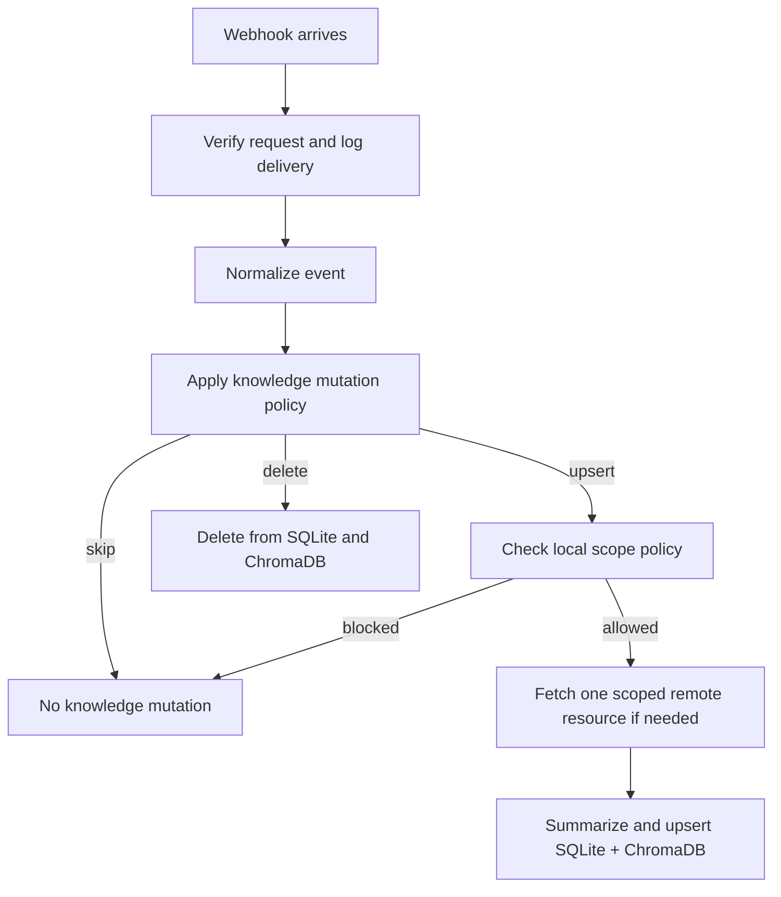

# Knowledge Sync Policy

## Purpose

The harness no longer seeds knowledge automatically when the server starts.

Knowledge now grows from webhook-driven lifecycle events and scoped on-demand retrieval.

## Current implementation

The current status path still lives in [backfill.py](../src/work_harness/services/backfill.py), but it is disabled and does not write to the knowledge store.

## Current operating policy

Bulk backfill is not the default knowledge strategy.

The implemented runtime now prefers:

1. local scoped retrieval from SQLite + ChromaDB
2. scoped single-resource remote fallback on a local miss
3. webhook-driven upsert or delete when a lifecycle event marks a useful knowledge boundary
4. storeability checks before persistence

That keeps the system safe for internal services while still letting the harness accumulate useful knowledge over time.

## Workflow diagram

## Historical data

Older data should not be bulk-loaded automatically.

The safer future approach is a selective hydrate flow:

1. the operator chooses an allowlisted Jira project, Confluence space, Slack channel, or GitHub repository
2. the harness fetches a bounded recent slice for that single scope
3. the same storeability and sanitization rules are applied before persistence
