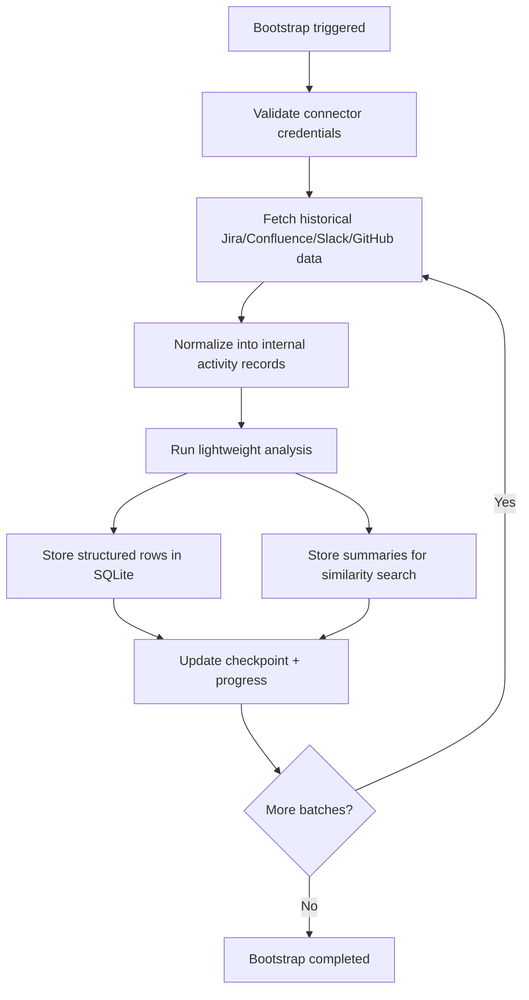

# Knowledge Bootstrap Flow

## Purpose

The bootstrap flow exists to avoid an empty knowledge base on first deployment. Instead of waiting for new live activity, the system should scan recent enterprise data, normalize it, summarize it, and store it so later agent runs can use similar past cases as context.

## Current implementation

The current code path lives in [bootstrap.py](/Users/maruldy/dev/workspace/aw01/src/work_harness/services/bootstrap.py). It is intentionally a safe dry run:

1. Mark bootstrap as `running`
2. Create one synthetic `AnalysisRecord`
3. Store it in SQLite through `KnowledgeStore`
4. Mark bootstrap as `completed`

This proves the orchestration, scheduler registration, and storage path end to end without requiring live enterprise credentials during local development.

## Target production flow

In production, the intended bootstrap pipeline is:

1. Validate connector credentials for Jira, Confluence, Slack, and GitHub
2. Pull historical data for a bounded time range such as the last 3-6 months
3. Normalize vendor-specific payloads into internal activity records
4. Run lightweight LLM analysis to extract issue summaries, keywords, owners, and likely next actions
5. Persist structured records into SQLite and searchable summaries into the vector layer
6. Record checkpoints so the job can resume after interruptions

## Workflow diagram

## Why this matters in the work harness

- The inbox can explain similar past incidents instead of starting from zero.
- Supervisor routing gets better context for proposals and prioritization.
- Human decisions become reusable organizational memory rather than one-off actions.
- Daily delta scans can stay small because the cold-start bulk load already populated the baseline.
