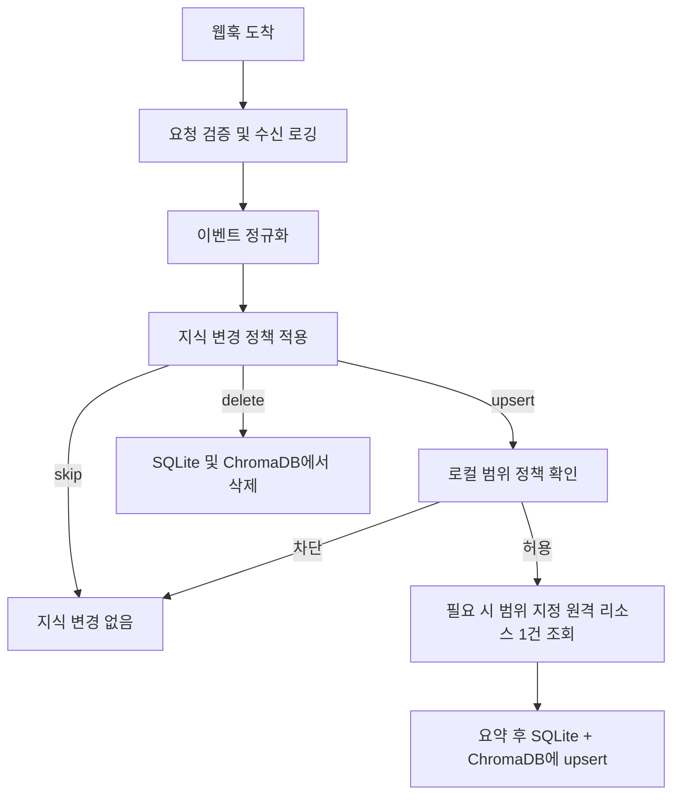

# 지식 전략

## 결정

하네스는 Jira, Confluence, Slack, GitHub에 대해 기본적으로 대량 히스토리 백필을 수행하지 않습니다.

대신 기본 지식 흐름은 다음과 같습니다:

1. 로컬 지식을 먼저 확인한다.
2. 로컬 히트가 약하면 원격 컨텍스트를 온디맨드로 조회한다.
3. 조회된 데이터의 저장 허용 여부를 판단한다.
4. 정제된 요약과 범위 지정 메타데이터만 저장한다.

이를 통해 내부 시스템에 대한 갑작스러운 대량 요청 위험을 줄이고, 지식 베이스를 운영자의 실제 작업 범위에 맞출 수 있습니다.

## 지식 동기화 정책

하네스는 서버 시작 시 자동으로 지식을 시딩하지 않습니다. 런타임은 수동 백필 트리거를 제공하지 않습니다.

지식은 다음을 통해 축적됩니다:

1. SQLite + ChromaDB에서 로컬 범위 지정 검색
2. 로컬 미스 시 범위 지정된 단일 리소스 원격 폴백
3. 라이프사이클 이벤트가 유용한 지식 경계를 표시할 때 웹훅 기반 upsert 또는 delete
4. 영속화 전 저장 가능성(storeability) 검사

이를 통해 내부 서비스에 대한 안전성을 유지하면서도 하네스가 시간이 지남에 따라 유용한 지식을 축적할 수 있습니다.

### 웹훅 기반 동기화 워크플로우

## 저장소 역할

### SQLite

SQLite는 원본(source of truth)입니다.

- 정규 레코드 메타데이터를 저장
- Jira 프로젝트, Confluence 스페이스, Slack 채널, GitHub 저장소 등 범위 정보를 저장
- 정제된 요약, 키워드, 타임스탬프, 의사결정 컨텍스트를 저장
- 소스, 범위, 최신성, 정책에 따른 필터링을 적용

### ChromaDB

ChromaDB는 시맨틱 인덱스입니다.

- 정제된 요약에서 파생된 임베딩용 텍스트를 저장
- 검색에 필요한 최소 메타데이터만 저장
- 정규 레코드 저장소 역할을 절대 하지 않음
- SQLite 정책 검사를 우회하지 않아야 함

## 검색 정책

검색은 하이브리드 방식이어야 합니다:

1. 수신 이벤트 또는 운영자 액션에서 범위 지정 쿼리를 구성한다.
2. SQLite에서 허용 범위 및 최신성으로 후보 레코드를 필터링한다.
3. ChromaDB에서 동일한 허용 범위에 대해 시맨틱 유사도 검색을 실행한다.
4. 결과를 병합하고 재정렬한다.
5. SQLite에서 최종 결과 상세 정보를 hydrate한다.

병합 결과가 약하면 하네스가 온디맨드로 원격 컨텍스트를 조회할 수 있습니다.

## 저장 가능성 게이트

원격 데이터는 조회되었다고 자동으로 저장되지 않습니다.

하네스는 소스가 운영자의 허용 작업 범위 안에 있을 때만 데이터를 저장해야 합니다.

예시:

- Jira: 이슈 프로젝트 키가 허용 프로젝트 목록에 있음
- Confluence: 페이지 스페이스 키가 허용 스페이스 목록에 있음
- Slack: 메시지 채널이 허용 채널 목록에 있거나, 운영자가 참여 중인 DM
- GitHub: 저장소가 명시적으로 허용된 저장소 목록과 일치

데이터가 현재 실행에 유용하지만 저장 가능성 게이트를 통과하지 못하면, 일시적 컨텍스트로만 사용 가능하며 영속화하지 않아야 합니다.

## 데이터 최소화

하네스는 다음을 저장하는 것을 선호해야 합니다:

- 정제된 요약
- 추출된 키워드
- 소스 식별자
- 범위 식별자
- 타임스탬프
- URL 또는 안정적 참조

하네스는 기본적으로 전체 원본 본문 저장을 피해야 하며, 특히 Slack과 Confluence 콘텐츠에 해당합니다.

## 히스토리 백필 정책

대량 백필은 기본적으로 구현되지 않습니다.

향후 백필을 구현할 경우 다음을 포함해야 합니다:

- 명시적 운영자 승인
- 엄격한 범위 허용 목록
- 제한된 시간 윈도우
- 낮은 동시성
- 프로바이더별 속도 제한
- 요청 예산
- 체크포인트 및 재개
- 안전한 중지 제어

향후 더 안전한 접근 방식은 선택적 hydrate 흐름입니다:

1. 운영자가 허용 목록에 있는 Jira 프로젝트, Confluence 스페이스, Slack 채널 또는 GitHub 저장소를 선택
2. 하네스가 해당 단일 범위에 대해 제한된 최근 분량을 조회
3. 영속화 전에 동일한 저장 가능성 및 정제 규칙을 적용

## 이 전략이 하네스에 적합한 이유

- 내부 시스템에 대해 더 안전
- 운영자 주도 범위에 더 잘 부합
- 가치가 낮은 대규모 코퍼스 구축을 방지
- 엄격한 정책 제어를 포기하지 않으면서 시맨틱 리콜을 지원
